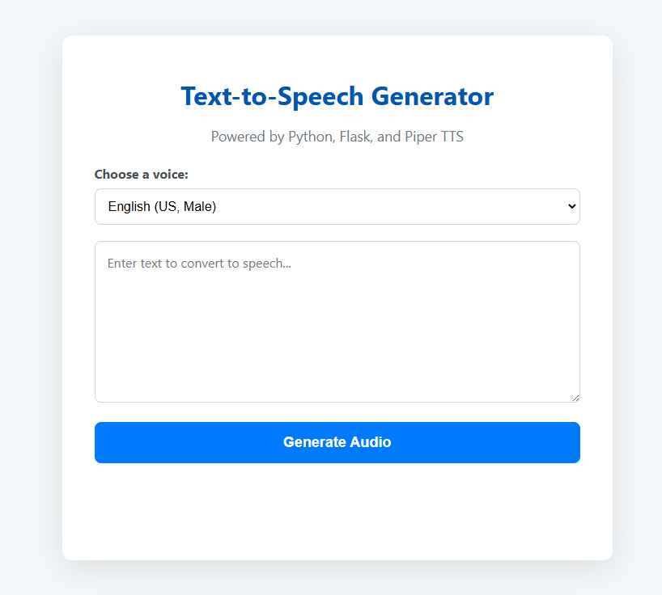

### **Hướng dẫn:**

1.  Trong repo `tts-flask-app` trên máy tính của bạn, tạo một file mới và đặt tên là `README.md`.
2.  Copy toàn bộ nội dung bên dưới và dán vào file `README.md` đó.
3.  Commit và push file này lên GitHub.

---

### **Nội dung file `README.md`**

```markdown
# Flask Text-to-Speech (TTS) Web App with Piper

Một ứng dụng web đơn giản, chạy trên máy tính cá nhân (local) để chuyển đổi văn bản thành giọng nói chất lượng cao bằng Python, Flask và công cụ mã nguồn mở Piper TTS.

<p align="center">
  
</p>

## ✨ Giới thiệu

Dự án này được tạo ra nhằm cung cấp một giải pháp Text-to-Speech miễn phí, không giới hạn và hoàn toàn offline (sau khi đã tải model giọng đọc). Thay vì phụ thuộc vào các dịch vụ API đám mây có giới hạn sử dụng, ứng dụng này cho phép người dùng tạo ra các file audio mẫu một cách nhanh chóng ngay trên máy của mình, phục vụ cho các mục đích học tập hoặc tạo nội dung.

## 🚀 Các tính năng chính

-   **Giao diện Web đơn giản:** Cung cấp một trang web trực quan để nhập văn bản và chọn giọng đọc.
-   **Giọng đọc chất lượng cao:** Sử dụng **Piper TTS** cho ra giọng nói tự nhiên và rõ ràng.
-   **Hỗ trợ đa giọng đọc:** Dễ dàng cấu hình để thêm nhiều giọng đọc khác nhau. Phiên bản hiện tại hỗ trợ:
    -   Tiếng Anh (Mỹ) - Nam & Nữ
    -   Tiếng Anh (Anh) - Nam
    -   Tiếng Việt - Nữ (Giọng miền Nam)
-   **Tự động tải Model:** Script sẽ tự động kiểm tra và tải về các "model giọng đọc" cần thiết từ Hugging Face trong lần chạy đầu tiên.
-   **Tạo Audio nhanh chóng:** Nhận văn bản từ người dùng, xử lý ở backend và trả về file audio để nghe trực tiếp trên trình duyệt.

## 🛠️ Công nghệ sử dụng

-   **Backend:** Python 3, Flask
-   **TTS Engine:** Piper TTS
-   **Frontend:** HTML5, CSS3, JavaScript (Vanilla)
-   **Thư viện Python:** `requests` (để tải model)

---

## ⚙️ Hướng dẫn Cài đặt & Chạy dự án

### Yêu cầu
-   [Python 3.8+](https://www.python.org/downloads/) đã được cài đặt.
    -   *Lưu ý quan trọng: Trong quá trình cài đặt Python, hãy chắc chắn rằng bạn đã tick vào ô **"Add Python to PATH"**.*

### Các bước cài đặt

1.  **Clone repository này về máy:**
    ```bash
    git clone https://github.com/TranHuuDat2004/tts-flask-app.git
    cd tts-flask-app
    ```

2.  **(Khuyến khích) Tạo và kích hoạt môi trường ảo:**
    ```bash
    # Tạo môi trường ảo
    python -m venv venv

    # Kích hoạt trên Windows
    .\venv\Scripts\activate

    # Kích hoạt trên macOS/Linux
    source venv/bin/activate
    ```

3.  **Cài đặt các thư viện cần thiết:**
    ```bash
    pip install Flask piper-tts requests
    ```

4.  **Chạy ứng dụng:**
    ```bash
    python app.py
    ```

### Hướng dẫn sử dụng

1.  Sau khi chạy lệnh `python app.py`, server sẽ khởi động. Mở trình duyệt và truy cập vào địa chỉ: [http://127.0.0.1:5000](http://127.0.0.1:5000)

2.  **Chờ tải model:** Trong lần chạy đầu tiên, server sẽ mất vài phút để tự động tải về các model giọng đọc cần thiết. Hãy theo dõi tiến trình trong cửa sổ dòng lệnh (CMD/Terminal).

3.  **Sử dụng giao diện:**
    -   Chọn giọng đọc bạn muốn từ menu dropdown.
    -   Nhập hoặc dán đoạn văn bản vào ô `textarea`.
    -   Nhấn nút **"Generate Audio"**.
    -   Chờ một vài giây và trình phát audio sẽ xuất hiện để bạn nghe kết quả.

---

## 📁 Cấu trúc thư mục

```
tts-flask-app/
├── app.py              # File server Flask chính
├── piper_voices/       # (Tự động tạo) Chứa các model giọng đọc
├── output_audio/       # (Tự động tạo) Chứa các file audio đã tạo
├── static/
│   └── style.css       # File CSS trang trí
└── templates/
    └── index.html      # Giao diện người dùng
```

## 📝 Tác giả

Dự án được phát triển bởi **Trần Hữu Đạt**.
```